<p align="center">
  <picture>
    <source media="(prefers-color-scheme: dark)" srcset="docs/screenshots/hero-dark.png" />
    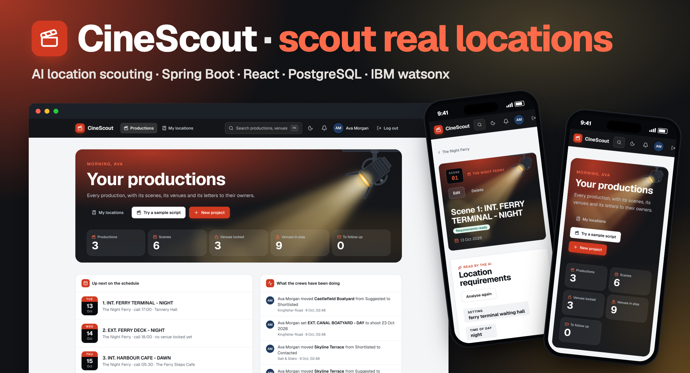
  </picture>
</p>

<h1 align="center">CineScout: scout real filming locations from a script</h1>

<p align="center">
  Paste a screenplay. CineScout reads each scene for the place it needs, finds real venues on the web,<br>
  scores how well each one fits, works out the light, weather and logistics on the shoot day,<br>
  and drafts the email to the owner. Then it plans the shoot: schedule, call sheet, budget and permits.
</p>

<p align="center">
  <a href="https://github.com/samaunmahmud/cinescout/actions/workflows/ci.yml"></a>
</p>

<p align="center">
  
  
  
  
  
  
  
  
  
  
  
  
</p>

<p align="center">
  <a href="https://cinescout-4zjm.onrender.com"><b>Try the live demo →</b></a><br>
  <sub>Make an account in a few seconds. The free server can take about a minute to wake up.</sub>
</p>

## Contents

- [The problem](#the-problem)
- [What it does](#what-it-does)
- [Results in numbers](#results-in-numbers)
- [Features](#features)
- [More screenshots](#more-screenshots)
- [How it works](#how-it-works)
- [Security, testing and CI](#security-testing-and-ci)
- [Getting started](#getting-started)
- [API](#api)
- [Project structure](#project-structure)
- [Design decisions](#design-decisions)
- [Limitations](#limitations)

## The problem

1. **A script says what a place feels like, not where it is.** "A cavernous waiting hall, half-lit, rain on tall
   windows" has to become a search for real buildings someone can book.
2. **Web search returns lists, not venues.** Most first results are "the 16 best rooftops in Brooklyn" pages,
   booking-site listings and duplicates of the same place.
3. **A good-looking place can still fail on the day.** The sun may be in the wrong part of the sky, it may rain,
   the street may be too loud, or there may be nowhere to park the trucks.
4. **The paperwork is scattered.** Contacts, quotes, holds, permits, call sheets and budgets usually live in
   different spreadsheets and inboxes.

## What it does

1. **Bring the script.** Paste or import a screenplay. It is cut into scenes at the `INT.`/`EXT.` headings, and the
   speaking parts are read from the script's format. No AI is used for this step.
2. **Read each scene.** IBM watsonx.ai reads a scene for the location it needs: the kind of place, mood, light, time
   of day, how quiet it must be and how many people will be on set. You can also scout from a reference photo.
3. **Find real places.** Parallel web search looks for venues in the production's area. Directory pages are
   dropped, the venues they name are looked up one by one, and duplicates are merged.
4. **Score them.** The model judges the kind of place and each stated requirement. The score itself is worked out in
   code, so it is consistent and explainable.
5. **Check the day.** For each venue: golden and blue hour, the sun's direction, the weather, noise risk, the nearest
   services, a place for the unit base, and the drive between venues on the same day.
6. **Lock it in.** Shortlist, compare side by side, record holds, draft the outreach email, track replies, and print
   a call sheet the crew can open from a link without an account.

## Results in numbers

These are counted from the repository or measured in live runs. Nothing is estimated.

| | |
|---|---|
| **840** | backend tests (JUnit 5, Mockito, WireMock, Testcontainers); 2 live smoke tests are skipped by default |
| **306** | web app tests (Vitest, Testing Library) |
| **133** | HTTP endpoints across 36 controllers |
| **30** | Flyway migrations; Hibernate only validates the schema |
| **36** | film offices in the permit guide: all 33 London boroughs, plus New York City, Los Angeles and Paris |
| **76 to 1** | spread of fit scores in a live Brooklyn diner run once scoring moved into code (asked for a number directly, the model gave nearly every venue 60) |
| **6 / 12** | distinct venues found in one live run each for a Brooklyn rooftop and a London warehouse scene |

## Features

| | Feature | What it does |
|---|---|---|
| 📜 | **Script import** | Cuts a screenplay into scenes at its headings and reads the speaking parts |
| 🧠 | **Scene reading** | watsonx.ai turns a scene into setting, mood, light, time of day, sound and crew size |
| 📷 | **Scout from a photo** | A vision model reads a reference picture and describes the place to look for |
| 🔎 | **Grounded scouting** | Real venues from Parallel web search, with directory pages and duplicates removed |
| 🎯 | **Fit score in code** | The model gives a verdict per requirement; code turns it into a 0-100 score |
| 📍 | **Near me and recce mode** | Scout around your current position; a phone view for notes and photos on site |
| 🗺️ | **Maps** | Leaflet with OpenStreetMap tiles; pins coloured by fit, click to move a pin |
| ☀️ | **Light and sun** | Golden and blue hour and the sun's direction at call time, computed locally (NOAA) |
| 🌧️ | **Weather and plan B** | Forecasts with a fallback provider, daily weather watch alerts, up to five cover sets per scene |
| 🔊 | **Noise and services** | Noise risk against the scene's needs, nearest hospital, food, toilets and parking |
| 🚚 | **Unit base and moves** | Car parks for the trucks, drive times between venues on the same day |
| ✉️ | **Outreach** | AI drafts the email to the owner, tracks sent and replied, flags follow-ups |
| 📅 | **Schedule and call sheet** | Shoot days, clashes, day-out-of-days, a printable call sheet with a share link |
| 💷 | **Budget and shot list** | Costs by category against a total, shots with size, camera bearing and time |
| 🏛️ | **Permit guidance** | The filming office for a public venue and the date to apply by |
| 📄 | **Location release and pack** | PDF release templates and a location pack, made with PDFBox |
| 👥 | **Crew and roles** | Owner, editor and viewer; invites by email; comments with mentions; activity log |
| 🎬 | **Director's link** | A shortlist the director can answer without an account |
| 🗓️ | **Calendar feed** | An iCalendar link of every shoot day you are on |
| 🌗 | **Light and dark themes** | A studio look in both, chosen before the first paint |

## More screenshots

<details>
<summary>Dashboard, scene, venue, schedule, budget, call sheet and phone views</summary>
<br>

The screenshots show a made-up production with invented venues.

| | |
|---|---|
| 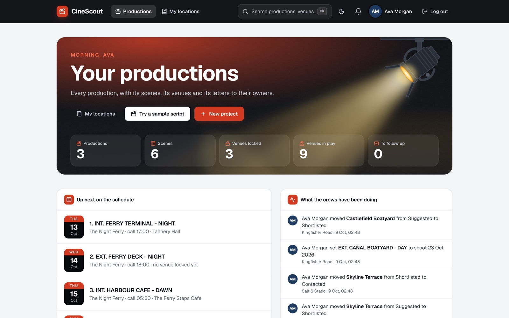 | 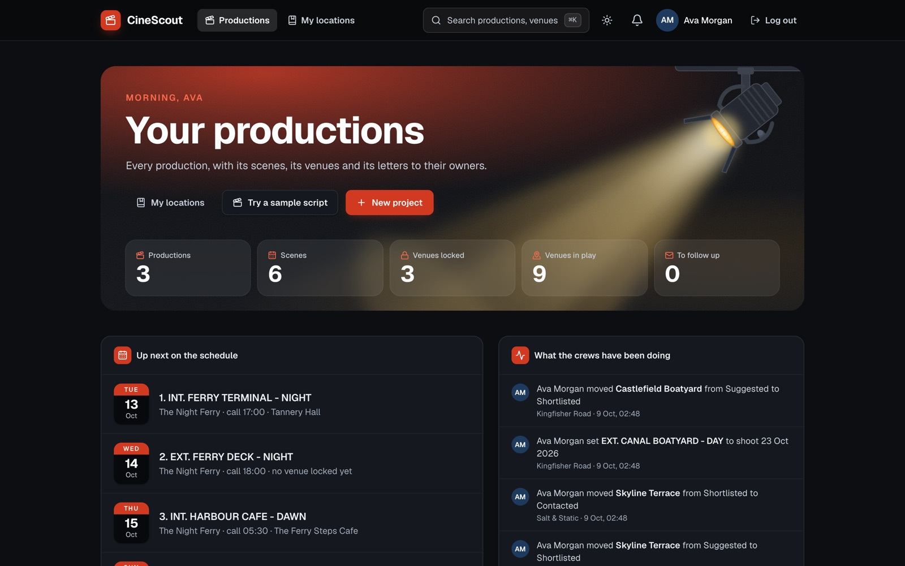 |
| 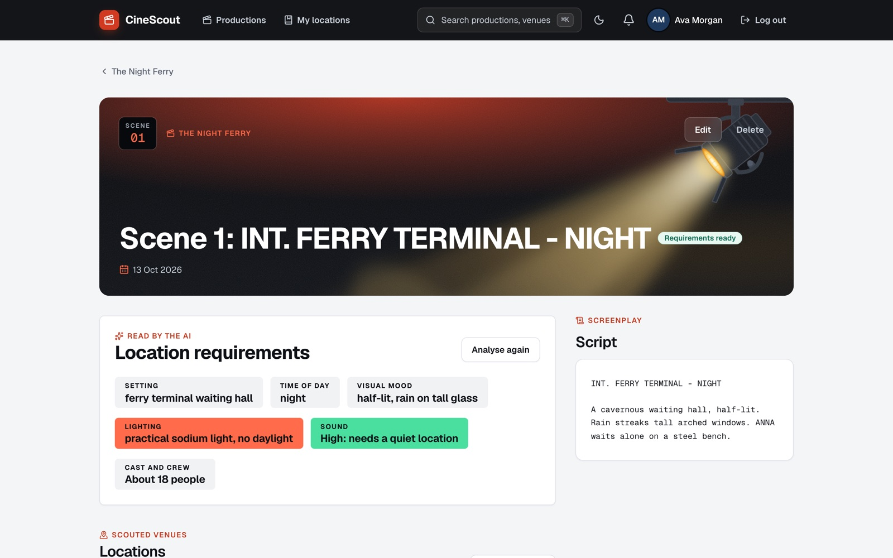 | 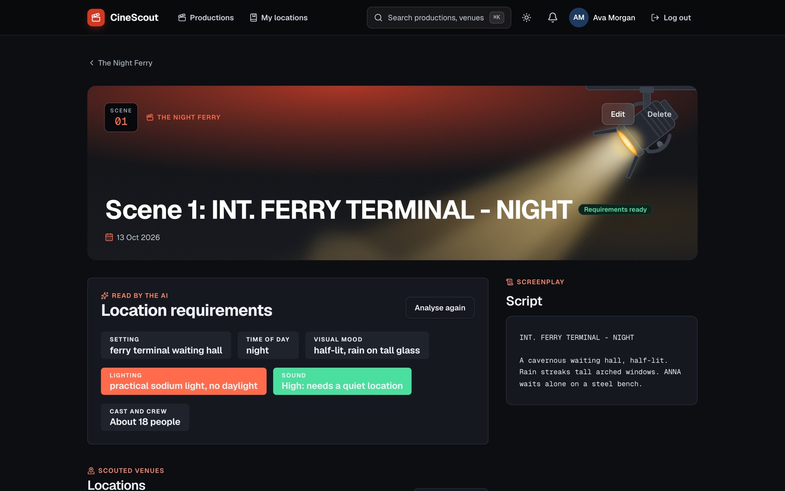 |
| 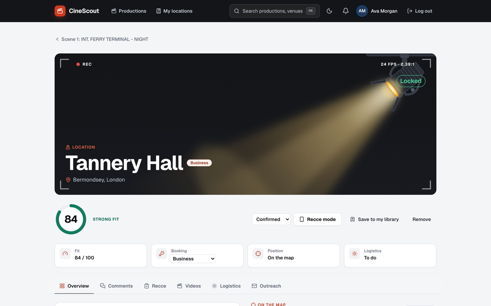 | 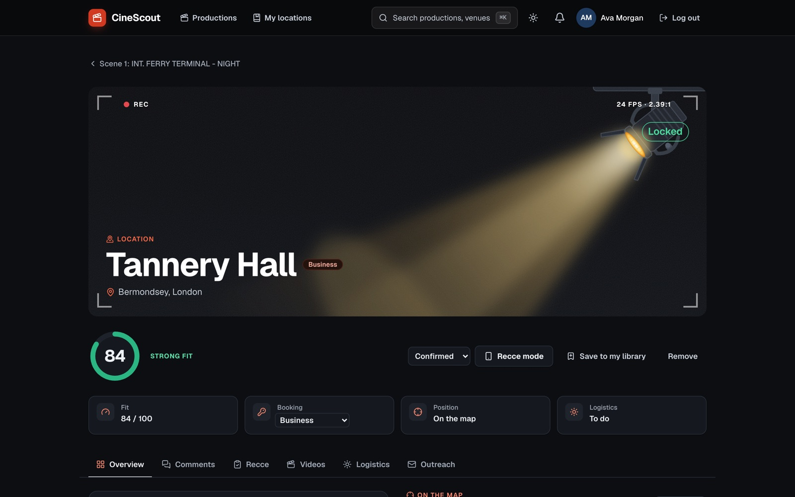 |
| 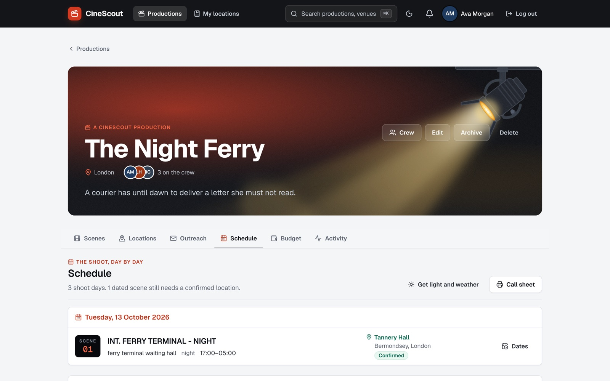 | 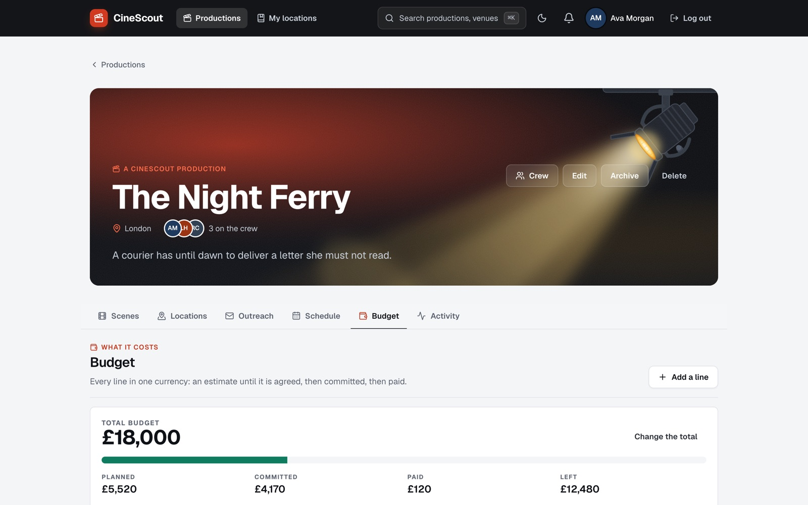 |
| 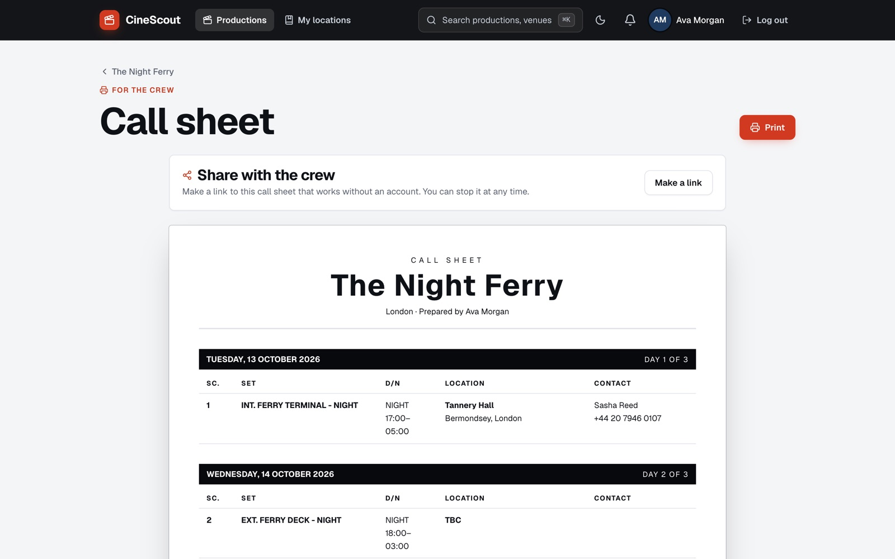 |  |

<p align="center">
  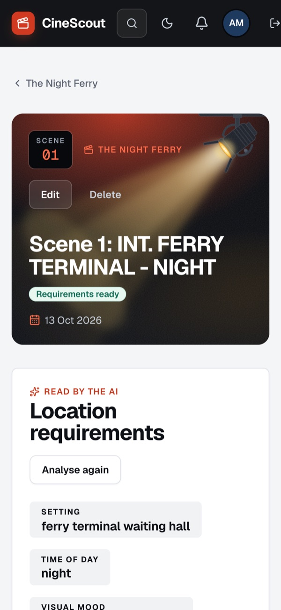
  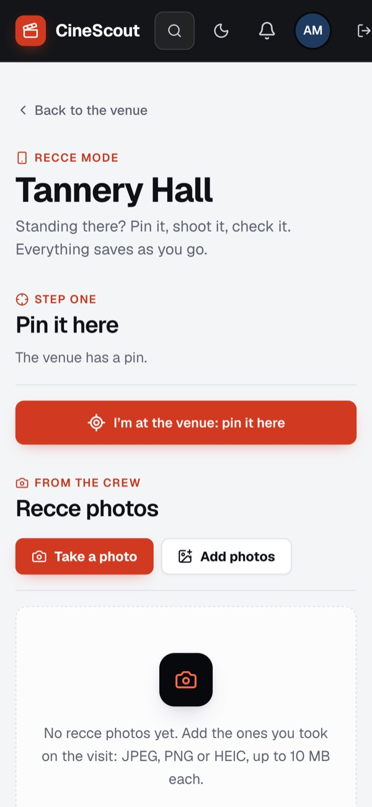
  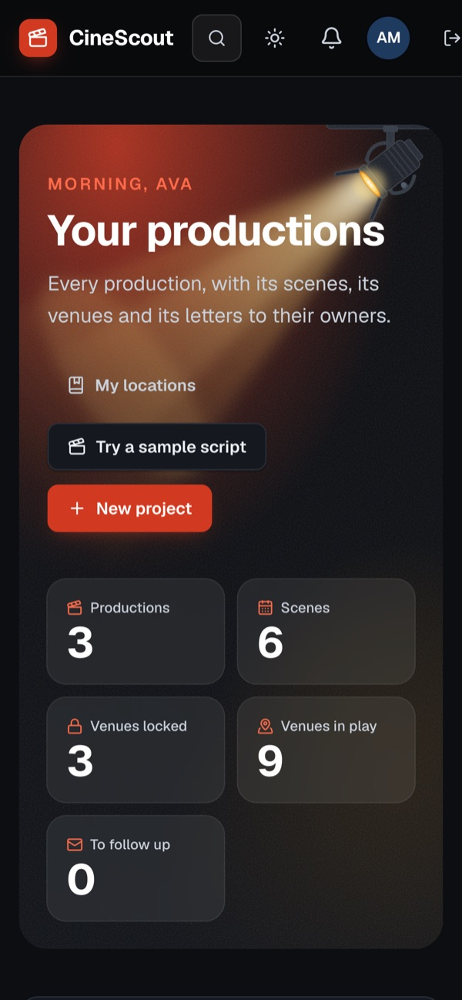
</p>
</details>

## How it works

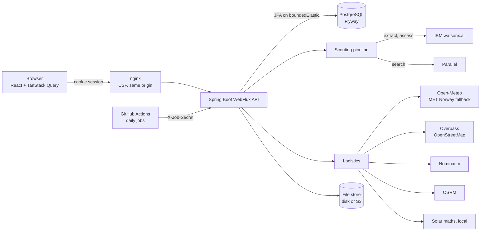

1. The web app talks to one origin. nginx serves the built app, sets the security headers and proxies `/api`.
2. The API is reactive (WebFlux), so a scouting run can call the model, search and map services at the same time.
   Database calls are blocking JPA, so they run on `Schedulers.boundedElastic()` and never on an event-loop thread.
3. The scouting pipeline is extract, search, assess. Every external call goes through retry and a circuit breaker,
   and calls to watsonx are spaced app-wide to stay under the plan's rate.
4. Logistics reports are cached on the venue. If a weather or map service is down, the report still comes back with
   that section marked unavailable.
5. Scheduled jobs (follow-ups, weather watch) run on the app's own timer and from a daily GitHub Actions workflow,
   because the free host sleeps when idle.

## Security, testing and CI

**Security**

- Session cookie for the web app: `HttpOnly`, `SameSite=Strict`, `Secure` over HTTPS. The database stores only a
  SHA-256 hash of the token.
- CSRF defence: the cookie only counts on requests that also send `X-Requested-With: XMLHttpRequest`.
- Logins take the same time whether or not the email exists.
- Access is checked by project membership: a stranger gets `404`, a member without the right role gets `403`.
- Rate limits per user on the AI and lookup features, and per address on logins, sign-ups and guest answers.
- Venue pictures are fetched through a guard that only connects to public addresses, at DNS resolution time too,
  so DNS rebinding cannot reach a private network.
- Uploaded photos are re-encoded without their metadata and served through short-lived signed links.
- nginx sets a strict Content-Security-Policy. Shared call sheets are `noindex` and `no-store`.
- Errors are RFC 9457 problem details.

**Testing**

- Backend: JUnit 5 and Mockito for units, WireMock for every external API, Testcontainers for a real PostgreSQL.
- Web: Vitest and Testing Library. The fake server fails any test that makes a request it was not told about.
- Live smoke tests for watsonx and Parallel are opt-in, so the normal run needs no keys and costs nothing.

**CI** (`.github/workflows/ci.yml`, on every push to `main` and every pull request)

1. Backend: `mvn -B -ntp verify` on Java 21, with Docker for Testcontainers.
2. Web: `npm ci`, lint (oxlint), tests and a production build on Node 22.
3. Docker image builds for the backend, the web app and the single-container Render image.

## Getting started

**Prerequisites:** Docker. For local development also JDK 21+, Maven and Node.js 22.

1. **Clone**

   ```bash
   git clone https://github.com/samaunmahmud/cinescout.git
   cd cinescout
   ```

2. **Set the environment.** Copy the example and set at least `DB_PASSWORD`. The AI keys are optional: without
   them the app runs, but scene reading, scouting and outreach answer `503`.

   ```bash
   cp .env.example .env
   # DB_PASSWORD=<any long random string>
   # WATSONX_API_KEY, WATSONX_PROJECT_ID, WATSONX_MODEL_ID, WATSONX_URL  (IBM watsonx.ai)
   # PARALLEL_API_KEY                                                     (Parallel search)
   ```

3. **Start everything** (PostgreSQL, the API and nginx). Flyway creates the schema on first start.

   ```bash
   docker compose up -d --build
   ```

4. **Open** http://localhost:8080 and make an account.

**Or run the parts yourself** for development:

```bash
# database
docker run -d --name cinescout-db -e POSTGRES_DB=cinescout -e POSTGRES_USER=cinescout \
  -e POSTGRES_PASSWORD=devpass -p 5432:5432 postgres:16-alpine

# API on :8081 (tests need Docker running)
cd backend
mvn test
DB_PASSWORD=devpass mvn spring-boot:run

# web app on :5173, proxies /api to :8081
cd ../frontend
npm install
npm run dev
npm test && npm run lint && npm run build
```

<details>
<summary>Advanced configuration</summary>

### Database and server

| Variable | Default |
|---|---|
| `DB_URL` | `jdbc:postgresql://localhost:5432/cinescout` |
| `DB_USERNAME` | `cinescout` |
| `DB_PASSWORD` | none, must be set |
| `PORT` | `8081` |

### AI and search

The LLM client is only created when `WATSONX_API_KEY` is set; the other two are then required. Scouting needs both
the watsonx and Parallel keys. Outreach needs only watsonx.

| Variable | Default |
|---|---|
| `WATSONX_API_KEY` | none, IBM Cloud API key |
| `WATSONX_PROJECT_ID` | none, must be set with the key |
| `WATSONX_MODEL_ID` | none, must be set with the key |
| `WATSONX_VISION_MODEL_ID` | `mistralai/mistral-small-3-1-24b-instruct-2503`, for scouting from a photo |
| `WATSONX_URL` | `https://us-south.ml.cloud.ibm.com` (e.g. `https://eu-gb.ml.cloud.ibm.com` for London) |
| `WATSONX_MAX_REQUESTS_PER_SECOND` | `2`, the free Lite plan's limit |
| `PARALLEL_API_KEY` | none, Parallel API key |
| `PARALLEL_URL` | `https://api.parallel.ai` |
| `YOUTUBE_API_KEY` | none; venue videos. Without it the page links to a YouTube search |

Live checks against the real services (skipped by default, billed to you):

```bash
WATSONX_LIVE_TEST=true WATSONX_API_KEY=... WATSONX_PROJECT_ID=... WATSONX_MODEL_ID=... \
  mvn test -Dtest=WatsonxLiveSmokeTest
PARALLEL_LIVE_TEST=true PARALLEL_API_KEY=... mvn test -Dtest=ParallelLiveSmokeTest
```

### How the fit score is made

The model does not pick the number. It says what kind of place the venue is next to the one the scene needs (exact,
close, dressable, unsuitable) and, for each stated requirement, whether the venue meets it, fails it or the page does
not say. `VenueVerdict.fitScore` turns that into 0-100: 70 for the right kind of place, up 6 for each requirement met,
down 8 for each failed (12 for too small or too loud). A venue that scores 0 is left out.

| Property | Default |
|---|---|
| `cinescout.scouting.assessment-concurrency` | `4` venues assessed at once |
| `cinescout.scouting.follow-up-venues` | `5` venues named on directory pages looked up per run |
| `cinescout.resilience.max-attempts` | `3` tries per LLM or search call |
| `cinescout.resilience.initial-backoff` / `max-backoff` | `500ms` / `5s` |
| `cinescout.resilience.breaker-failure-rate-percent` | `50` |
| `cinescout.resilience.breaker-open-duration` | `30s` |

### Logistics services

All keyless. Their usage policies ask for an identifying User-Agent and light use.

| Property | Default |
|---|---|
| `cinescout.logistics.user-agent` | `CineScout/0.1 (+https://github.com/samaunmahmud/cinescout)`; put your own contact here |
| `cinescout.logistics.open-meteo.forecast-url` | `https://api.open-meteo.com` |
| `cinescout.logistics.met-norway.enabled` | `true`: MET Norway answers when Open-Meteo turns a request away |
| `cinescout.logistics.overpass.base-url` | `https://overpass-api.de` |
| `cinescout.logistics.overpass.fallback-url` | `https://overpass.openstreetmap.fr` |
| `cinescout.logistics.overpass.unit-base-radius` | `1000` metres (200-3000) |
| `cinescout.logistics.nominatim.base-url` | `https://nominatim.openstreetmap.org` (one request a second) |
| `cinescout.logistics.osrm.base-url` | `https://router.project-osrm.org` |
| `VITE_MAP_TILE_URL` / `VITE_MAP_TILE_ATTRIBUTION` | OpenStreetMap's own tiles; set another provider at build time for real traffic |

### Files (recce photos, releases)

| Variable | Default |
|---|---|
| `FILES_STORE` | `local`, or `s3` for an S3-compatible bucket (Cloudflare R2, MinIO, AWS S3) |
| `FILES_DIR` | `<tmp>/cinescout-files` |
| `FILES_S3_ENDPOINT` / `FILES_S3_BUCKET` / `FILES_S3_REGION` | none / none / `auto` |
| `FILES_S3_ACCESS_KEY` / `FILES_S3_SECRET_KEY` | none |
| `FILES_SIGNING_KEY` | random at each start; set it so photo links survive a restart |

### Reply tracking (optional)

Each outreach email can carry its own reply address, `scout+<token>@<reply domain>`. Postmark posts replies to
`POST /api/inbound/postmark`. Without a provider, replies are pasted in by hand.

| Variable | Default |
|---|---|
| `MAIL_REPLY_DOMAIN` | none |
| `MAIL_REPLY_LOCAL_PART` | `scout` |
| `MAIL_INBOUND_PROVIDER` | none, or `postmark` |
| `MAIL_INBOUND_USERNAME` / `MAIL_INBOUND_PASSWORD` | none: Basic credentials in the webhook URL |

### Scheduled jobs

`POST /api/internal/jobs/<name>` (`follow-ups`, `weather-watch`) with the header `X-Job-Secret`. The daily
`.github/workflows/jobs.yml` calls it when the repository has the secrets `CINESCOUT_URL` and `JOBS_SECRET`.
Running a job twice is harmless.

| Variable | Default |
|---|---|
| `JOBS_SECRET` | none: the endpoint answers 404 and only the app's own timer runs the jobs |
| `JOBS_SCHEDULER` | `true` |
| `JOBS_FOLLOW_UPS_CRON` | `0 17 * * * *` (hourly) |
| `JOBS_WEATHER_WATCH_CRON` | `0 23 6 * * *` (daily, 06:23 UTC) |
| `JOBS_WEATHER_VENUES` | `40` forecasts a run |

### Rate limits

Past a limit the API answers `429` with `Retry-After`. Each is a burst of `capacity` calls refilled over `period`
(`cinescout.rate-limits.<name>.capacity` / `.period`); `cinescout.rate-limits.enabled=false` turns them off.

| Limit | Counts | Default |
|---|---|---|
| `ai` | scene reading and outreach, per user | 30 an hour |
| `scouting` | scouting runs, per user | 10 an hour |
| `lookups` | logistics, videos, pictures, per user | 120 an hour |
| `login` | failed logins, per address | 20 per 10 minutes |
| `register` | new accounts, per address | 5 an hour |
| `guest` | director's link answers, per address | 60 an hour |

### Deploying

- **Docker Compose** (above) for one machine. For a public host, Caddy fetches certificates:
  `DOMAIN=cinescout.example.com docker compose --profile https up -d --build`. Set `REGISTRATION_OPEN=false` once
  your accounts exist.
- **Render**: `deploy/render/Dockerfile` builds one container in which the backend also serves the web app, sized for
  a 512 MB instance; `render.yaml` describes it. The database is separate, for example a free Neon PostgreSQL.

### Permit guide

The offices live in `backend/src/main/resources/permits/filming-offices.yml`, with sources and a review date. To
correct an entry, edit the file, set `lastReviewed` and open a pull request. A broken file stops the app at start-up
and fails `FilmingOfficesTest`.

</details>

## API

Interactive docs at `/swagger-ui.html`, the OpenAPI description at `/v3/api-docs`. All routes are under `/api`. Lists
come a page at a time (`?page=`, `?size=` up to 100). Another user's resource is always `404`.

| Area | Main routes |
|---|---|
| Accounts | `POST /auth/register`, `POST /auth/login`, `POST /auth/logout`, `GET /auth/me`, `PUT /account`, `PUT /account/password`, `POST /account/delete` |
| Dashboard and search | `GET /dashboard`, `GET /search?q=`, `GET /alerts`, `GET /alerts/unread-count` |
| Projects | `POST`/`GET /projects`, `GET`/`PUT`/`DELETE /projects/{id}`, `GET /projects/{id}/progress`, `GET`/`PUT /projects/{id}/settings` |
| Crew | `GET`/`POST /projects/{id}/members`, `GET /projects/{id}/activity` |
| Scenes | `POST`/`GET /projects/{id}/scenes`, `GET`/`PUT`/`DELETE /scenes/{id}`, `PUT /scenes/{id}/shoot-dates`, `POST /projects/{id}/scenes/import[/preview]` |
| Scouting | `POST /scenes/{id}/parse`, `POST /projects/{id}/scenes/parse`, `POST /scenes/{id}/scout` |
| Locations | `POST`/`GET /scenes/{id}/locations`, `GET`/`PUT`/`DELETE /locations/{id}`, `PUT /locations/{id}/coordinates`, `PUT /locations/{id}/contact`, `GET /projects/{id}/locations[/export]` |
| Logistics | `POST`/`GET /locations/{id}/logistics`, `POST /projects/{id}/logistics`, `GET /locations/{id}/permit`, `GET /projects/{id}/moves` |
| Planning | `GET /projects/{id}/schedule`, `GET`/`PUT /locations/{id}/availability`, `GET`/`POST /scenes/{id}/covers`, `GET`/`POST /scenes/{id}/shots`, `GET`/`PUT /projects/{id}/budget` |
| Outreach | `POST /locations/{id}/outreach-drafts/generate`, `GET /locations/{id}/outreach-drafts`, `GET`/`PUT`/`DELETE /outreach-drafts/{id}`, `POST /outreach-drafts/{id}/follow-up` |
| Files | `GET`/`POST /locations/{id}/photos`, `GET`/`POST /locations/{id}/agreements`, `GET /agreements/{id}/file` |
| Library | `GET /library`, `GET /library/tags`, `POST /scenes/{id}/locations/from-library` |
| Public (no login) | `GET /public/call-sheets/{token}`, `GET /public/shortlists/{token}`, `GET /public/calendars/{token}.ics` |

## Project structure

```
cinescout/
├── backend/                         Spring Boot API (com.cinescout)
│   └── src/
│       ├── main/java/com/cinescout/
│       │   ├── ai/  llm/  search/   model and search clients, prompts, fit score
│       │   ├── scouting/  script/   pipeline and screenplay splitting
│       │   ├── logistics/           solar, weather, places, routing, unit base
│       │   ├── outreach/  mail/     email drafts and reply tracking
│       │   ├── permits/  calendar/  agreements/  pack/  photos/  files/
│       │   ├── jobs/  ratelimit/  resilience/  security/
│       │   ├── domain/  persistence/  repository/  dto/
│       │   ├── service/             business logic and access checks
│       │   └── web/                 REST controllers, error handling
│       ├── main/resources/
│       │   ├── db/migration/        Flyway V1 to V30
│       │   └── permits/             filming offices
│       └── test/                    JUnit, WireMock, Testcontainers
├── frontend/                        React web app
│   └── src/
│       ├── api/  auth/              typed client, session
│       ├── pages/  components/      screens and shared UI
│       ├── lib/                     formatting, schedule, theme helpers
│       └── test/                    fake server and fixtures
├── deploy/render/                   single-container image
├── docs/                            architecture notes, screenshots
├── docker-compose.yml               PostgreSQL + API + nginx (+ Caddy)
└── .github/workflows/               CI and daily jobs
```

More on the schema and the entity relationships in [docs/architecture.md](docs/architecture.md).

## Design decisions

| Decision | Why |
|---|---|
| WebFlux for the web layer | A scouting run calls the model, search, geocoding and map services. Doing these at once keeps a run to seconds. |
| Blocking JPA on `boundedElastic` | JPA and Flyway are mature and simple. Moving them off the event loop keeps WebFlux responsive without R2DBC. |
| Flyway owns the schema, Hibernate validates | Every change is a reviewed SQL migration. A mismatch fails at start-up, not in production data. |
| Fit score computed in code | Asked for a number, the model anchored at 60. A verdict per requirement is easier to check and gives a real spread. |
| Provider-neutral interfaces (`LlmClient`, `LocationSearchClient`, `WeatherClient`, `RoutingClient`) | Providers changed during the build (Gemini to watsonx). Fallbacks for weather and places slot in behind the same interface. |
| Keyless map and weather services | Anyone can run the app without accounts. Fallback servers cover the rate limits of a shared free host. |
| Session cookie plus `X-Requested-With` | `HttpOnly` keeps the token from scripts; the header check stops cross-site requests without a CSRF token store. |
| Logistics report cached on the venue | The public services are slow and limited. Reading the saved report avoids calling them again on every visit. |
| Permit guide as a reviewed YAML file | Office details change. A file with sources and a review date can be corrected by a pull request and is validated at start-up. |
| Dates on the shoot's own clock | Call times are local to the venue, so the calendar uses floating time and the reports use the venue's time zone. |

## Limitations

- **The live demo sleeps.** It runs on Render's free tier and takes about a minute to wake after a quiet spell.
- **Uploaded files on the demo do not last.** Without an S3 or R2 bucket set, recce photos and releases are lost on each
  redeploy.
- **Replies are manual by default.** Automatic reply tracking needs a Postmark inbound domain.
- **Some venues stay off the map.** Booking sites often hide the address, and Nominatim rarely finds a listing title,
  so those venues need a pin set by hand.
- **AI quota.** The watsonx Lite plan has a monthly token quota and 2 requests a second. When the quota runs out, AI
  features answer `503` until it renews.
- **Public map services are rate-limited.** Overpass, Nominatim and OSRM are shared servers; heavy use needs your own.
- **Permit guidance covers London, New York City, Los Angeles and Paris only.** The rest of the UK gets a pointer to
  the local council. It is guidance, not legal advice.
- **Rate limits live in memory.** A restart forgets them, and each instance counts on its own.

<p align="center">
  Built by Samaun Mahmud · Computer Science (AI), Brunel University London
</p>
