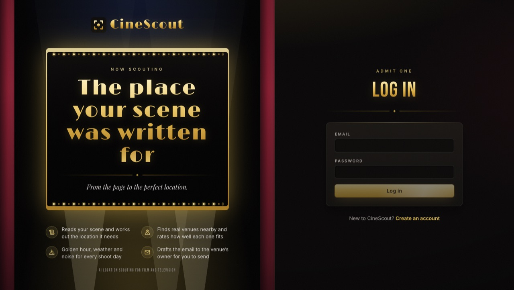
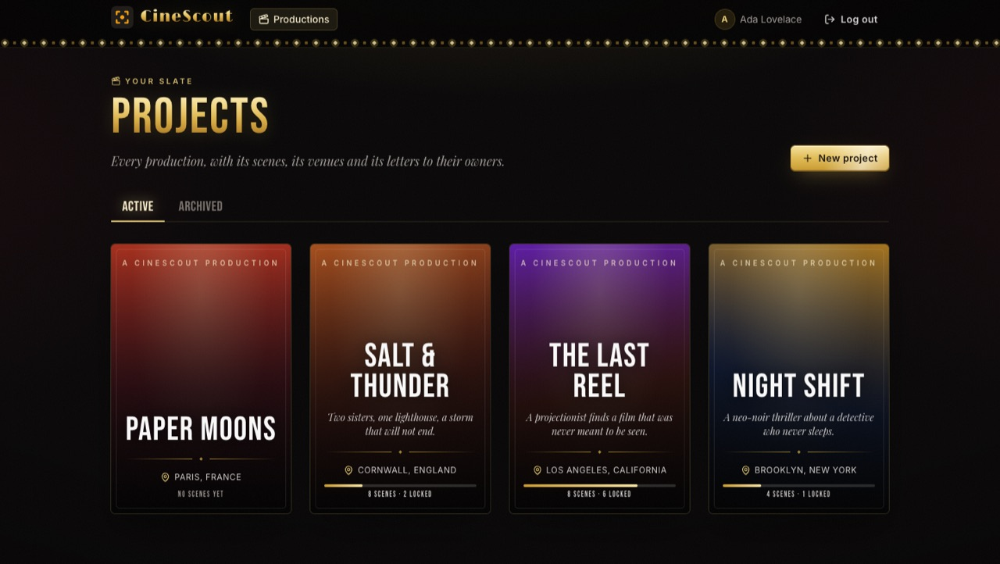
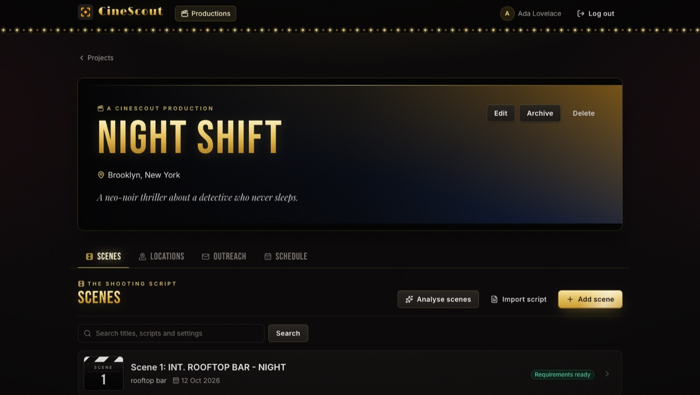
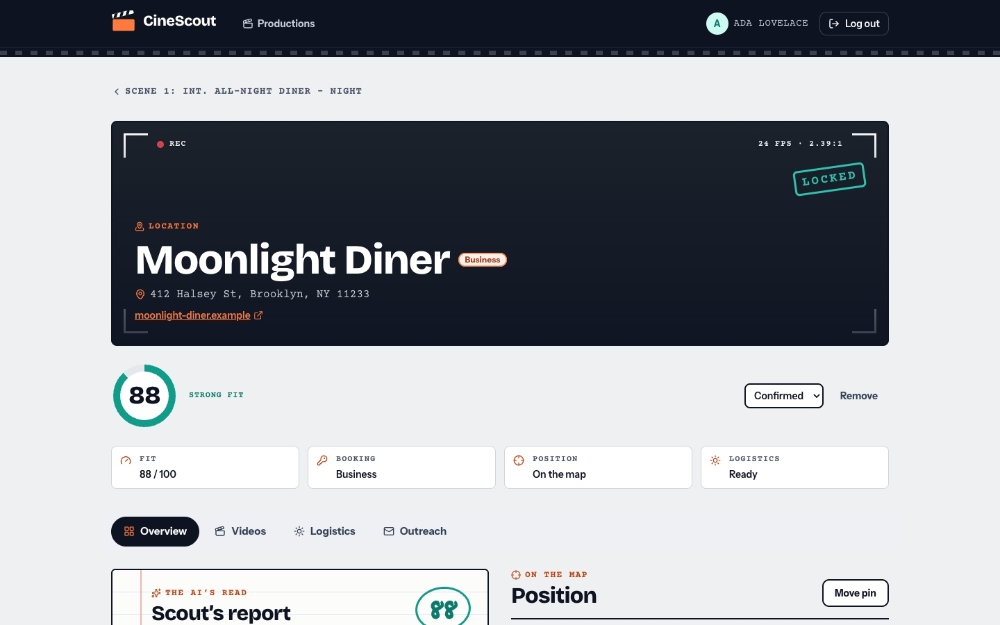

# CineScout

[](https://github.com/samaunmahmud/cinescout/actions/workflows/ci.yml)

AI production and location scouting. A filmmaker submits a scene; the platform extracts the
physical location requirements, finds real venues with grounded web search, assesses booking
friction, computes shoot logistics (light, weather, noise risk, nearby services) and drafts
outreach to venue owners.

| | |
|---|---|
|  |  |
|  |  |

The schedule prints as a [call sheet](docs/screenshots/callsheet.jpg). The screenshots show made-up productions.

> Work in progress. The backend is being built one step at a time; see [Status](#status).

## Stack

- Java 21, Spring Boot 3.5, Spring WebFlux
- PostgreSQL, Spring Data JPA, Flyway (Flyway owns the schema; Hibernate only validates it)
- JUnit 5, Mockito, WireMock, Testcontainers
- Spring Security, springdoc OpenAPI, Resilience4j
- Open-Meteo (weather) and OpenStreetMap via Overpass and Nominatim (places, geocoding), all keyless
- Frontend: React, TypeScript, Vite, Tailwind CSS, React Router, TanStack Query; Vitest and Testing Library

## Layout

| Path | Contents |
|---|---|
| `backend/` | Spring Boot application (`com.cinescout`) |
| `frontend/` | React web app |
| `backend/src/main/resources/db/migration/` | Flyway migrations |
| `docs/architecture.md` | Entity relationships and schema decisions |

## Running

Requires JDK 21+ and Maven. The tests start PostgreSQL through Testcontainers, so Docker
must be running.

```bash
cd backend
mvn test
DB_PASSWORD=... mvn spring-boot:run
```

The web app needs Node.js 20.19+ (or 22.12+). With the backend running:

```bash
cd frontend
npm install
npm run dev      # http://localhost:5173, proxies /api to the backend
npm test
npm run build
```

GitHub Actions (`.github/workflows/ci.yml`) runs the same checks on every push to `main` and every pull
request: the backend tests, the web app's lint, tests and build, and both Docker image builds.

The dev server proxies `/api` to `http://localhost:8081`; set `BACKEND_URL` to point it elsewhere. The web app
logs in with a session cookie (see Authentication), so a reload keeps you logged in.

Maps use Leaflet with OpenStreetMap's own tile server, which needs no key but is meant for light use only
([tile usage policy](https://operations.osmfoundation.org/policies/tiles/)). For a real deployment, set
`VITE_MAP_TILE_URL` (a `{z}/{x}/{y}` template) and `VITE_MAP_TILE_ATTRIBUTION` at build time to another provider.

Configuration comes from the environment:

| Variable | Default |
|---|---|
| `DB_URL` | `jdbc:postgresql://localhost:5432/cinescout` |
| `DB_USERNAME` | `cinescout` |
| `DB_PASSWORD` | none, must be set |
| `PORT` | `8081` |

The LLM client (IBM watsonx.ai) is only created when `WATSONX_API_KEY` is set, so the app
still starts without IBM credentials. When it is set, the other two are required:

| Variable | Default |
|---|---|
| `WATSONX_API_KEY` | none, IBM Cloud API key |
| `WATSONX_PROJECT_ID` | none, must be set with the key |
| `WATSONX_MODEL_ID` | none, must be set with the key |
| `WATSONX_URL` | `https://us-south.ml.cloud.ibm.com` (the region your watsonx project is in, e.g. `https://eu-gb.ml.cloud.ibm.com` for London) |
| `WATSONX_MAX_REQUESTS_PER_SECOND` | `2`, the free (Lite) plan's limit; raise it on a paid plan |

Calls to the model are spaced out app-wide to stay under that rate: extra calls wait their turn
(up to 30 seconds) instead of being refused by IBM, so a scouting run that assesses ten venues
takes a few seconds longer rather than losing most of them.

To check the client against the real service (skipped by default, billed to your project):

```bash
WATSONX_LIVE_TEST=true WATSONX_API_KEY=... WATSONX_PROJECT_ID=... WATSONX_MODEL_ID=... \
  mvn test -Dtest=WatsonxLiveSmokeTest
```

Likewise the search client (Parallel) is only created when `PARALLEL_API_KEY` is set:

| Variable | Default |
|---|---|
| `PARALLEL_API_KEY` | none, Parallel API key |
| `PARALLEL_URL` | `https://api.parallel.ai` |

```bash
PARALLEL_LIVE_TEST=true PARALLEL_API_KEY=... mvn test -Dtest=ParallelLiveSmokeTest
```

Scouting (extract requirements, search, assess venues, save candidates) needs **both** keys, so
without them the app still starts but has no scouting beans. Outreach email generation needs only the
watsonx.ai key.

For many settings the web's first answers are directories ("The 16 best rooftop venues in Brooklyn")
rather than venues. The model says which results are about one venue; the others are left out and
counted in the result's `notVenues`, and the venues they name are looked up by name and assessed
too. A venue found on several of its pages is saved once, and one the model scores 0 (unusable, e.g. in
another city) is left out and counted in `unsuitable`. Optional tuning, all with defaults:

| Property | Default |
|---|---|
| `cinescout.scouting.assessment-concurrency` | `4` venues assessed by the LLM at once |
| `cinescout.scouting.follow-up-venues` | `5` venues named on directory pages looked up per run (`0` turns it off) |
| `cinescout.resilience.max-attempts` | `3` tries per LLM or search call |
| `cinescout.resilience.initial-backoff` / `max-backoff` | `500ms` / `5s` |
| `cinescout.resilience.breaker-window-size` / `-minimum-calls` | `10` / `5` |
| `cinescout.resilience.breaker-failure-rate-percent` | `50` |
| `cinescout.resilience.breaker-open-duration` | `30s` |

Shoot logistics (sun, weather, noise, nearby services) use free public services that need no keys, so
they are always on. Their usage policies ask for an identifying User-Agent and light use; anything beyond
that should point the base URLs at a private or commercial instance:

| Property | Default |
|---|---|
| `cinescout.logistics.user-agent` | `CineScout/0.1 (+https://github.com/samaunmahmud/cinescout)`; a deployment should put its own contact here |
| `cinescout.logistics.max-days` | `14` shoot days per report |
| `cinescout.logistics.open-meteo.forecast-url` / `archive-url` | `https://api.open-meteo.com` / `https://archive-api.open-meteo.com` (weather; free for non-commercial use) |
| `cinescout.logistics.overpass.base-url` | `https://overpass-api.de` (OpenStreetMap places) |
| `cinescout.logistics.nominatim.base-url` | `https://nominatim.openstreetmap.org` (geocoding, at most one request a second) |

## Venue videos

With `YOUTUBE_API_KEY` set (a Google Cloud API key with the YouTube Data API v3 enabled),
`GET /api/locations/{id}/videos` searches YouTube for the venue's name and address (or the project's area)
and the location page shows the videos, playing them in place with YouTube's no-cookie player. A search
costs 100 of the free 10,000 daily quota units, so results are cached on the location for a week
(`cinescout.video.cache-ttl`), or until its name or address changes. Without a key the endpoint answers 503
and the page links to a YouTube search instead.

## Deploying

`docker-compose.yml` runs the whole thing on one machine: PostgreSQL, the API, and nginx serving the web
app and proxying `/api` to it on the same origin. Only the web port is published.

```bash
cp .env.example .env          # set DB_PASSWORD, and the API keys you have
docker compose up -d --build  # http://localhost:8080
```

For a public host, point a DNS name at it and let Caddy fetch certificates:

```bash
DOMAIN=cinescout.example.com docker compose --profile https up -d --build
```

Every container has a health check (the API's is `GET /actuator/health`, the only actuator endpoint
exposed). nginx sets `Content-Security-Policy` and the other usual headers, and passes on the scheme the
browser used, so the session cookie is `Secure` over HTTPS. Before going public, set `REGISTRATION_OPEN=false`
once your accounts exist, put your own contact in `OSM_USER_AGENT`, and consider a tile provider for the
maps (see `.env.example`). Remove the `/v3/api-docs` and `/swagger-ui` blocks from `frontend/nginx.conf` to
keep the API docs private.

## Authentication

Every endpoint needs a login except registering, logging in and out. There are two ways to log in, both
against the `users` table:

- **Session cookie (the web app).** `POST /api/auth/login` sets an `HttpOnly`, `SameSite=Strict` cookie
  holding a random token; the database stores only its SHA-256 hash. It lasts
  `cinescout.security.session-ttl` (14 days) or until `POST /api/auth/logout`. As a CSRF defence the cookie
  only counts on requests that also send `X-Requested-With: XMLHttpRequest`. It is `Secure` when the request
  came over HTTPS; set `cinescout.security.cookie-secure` to force it either way.
- **HTTP Basic (scripts, Swagger UI).** Send the email and password with every request:

```bash
curl -X POST localhost:8081/api/auth/register -H 'Content-Type: application/json' \
  -d '{"email":"ada@example.com","password":"a-long-password","displayName":"Ada"}'
curl -u ada@example.com:a-long-password localhost:8081/api/auth/me
```

Errors are RFC 9457 problems (`application/problem+json`). Set `cinescout.security.registration-open=false`
to stop new accounts being created on a deployment that should not be public. Both logins carry secrets,
so run any deployment behind HTTPS.

### Rate limits

The paid and rate-limited services are protected per user, and logins and sign-ups per client address. Past a
limit the API answers `429` with a `Retry-After` header and a problem saying when to try again. Each limit is a
burst of `capacity` calls, refilled evenly over `period` (`cinescout.rate-limits.<name>.capacity` / `.period`):

| Limit | Counts | Default |
|---|---|---|
| `ai` | scene parsing and outreach generation, per user | 30 an hour |
| `scouting` | scouting runs, per user | 10 an hour |
| `lookups` | logistics runs and venue video searches, per user | 120 an hour |
| `login` | failed logins (web app and HTTP Basic), per address | 20 per 10 minutes |
| `register` | new accounts, per address | 5 an hour |

The counts live in memory: a restart forgets them, and each instance counts on its own. Behind nginx the
client address comes from `X-Forwarded-For`, which nginx sets itself (trusting it only from private networks,
such as Caddy's). `cinescout.rate-limits.enabled=false` turns them all off.

## API

Once running, the interactive documentation is at `/swagger-ui.html` and the OpenAPI description at
`/v3/api-docs` (turn both off with `springdoc.api-docs.enabled=false`). Routes, all under `/api`:

| Area | Routes |
|---|---|
| Accounts | `POST /auth/register` (public), `POST /auth/login`, `POST /auth/logout`, `GET /auth/me`, `PUT /account`, `PUT /account/password`, `POST /account/delete` |
| Projects | `POST /projects`, `GET /projects[?status=]`, `GET`/`PUT`/`DELETE /projects/{id}`, `GET /projects/{id}/progress`, `GET /projects/{id}/schedule` |
| Scenes | `POST /projects/{id}/scenes`, `GET /projects/{id}/scenes[?q=]`, `GET`/`PUT`/`DELETE /scenes/{id}`, `PUT /scenes/{id}/shoot-dates`, `POST /projects/{id}/scenes/import[/preview]` |
| Locations | `POST`/`GET /scenes/{id}/locations`, `GET`/`PUT`/`DELETE /locations/{id}`, `PUT /locations/{id}/coordinates`, `PUT /locations/{id}/contact`, `POST /locations/{id}/image`, `GET /projects/{id}/locations[?status=]`, `GET /projects/{id}/locations/export[?status=]` |
| Logistics | `POST`/`GET /locations/{id}/logistics`, `POST /projects/{id}/logistics` |
| Scouting | `POST /scenes/{id}/parse`, `POST /projects/{id}/scenes/parse`, `POST /scenes/{id}/scout[?maxResults=]` |
| Call sheet sharing | `GET`/`POST`/`DELETE /projects/{id}/call-sheet-link`, `GET /public/call-sheets/{token}` (no login) |
| Outreach | `POST /locations/{id}/outreach-drafts/generate`, `GET /locations/{id}/outreach-drafts`, `GET /projects/{id}/outreach-drafts[?status=]`, `GET`/`PUT`/`DELETE /outreach-drafts/{id}` |

The lists (projects, scenes, locations, outreach drafts) come a page at a time: `?page=` (zero-based,
default `0`) and `?size=` (default `50`, at most `100`). The answer is
`{ "items": [...], "page", "size", "totalItems", "totalPages" }`, each list in its own fixed order.

`PUT` is a full replacement. Someone else's resource is always a `404`. The scouting routes and
`generate` call paid services and can take many seconds; they answer `503` when the server has no
AI keys (`generate` needs only the watsonx.ai key), and `429` past the user's [rate limit](#rate-limits). Listing, editing and deleting drafts always works.
The API never sends an email: a draft's `status` (`DRAFT`, `SENT`, `REPLIED`) is what the user reports.

`GET /projects/{id}/locations` is the project-wide view of the candidates: every scene's locations in one list,
scene by scene in script order, each row naming its scene; `?status=SHORTLISTED` (or any other status) narrows
it. `GET /projects/{id}/progress` counts the scenes, the ones with candidates and with a confirmed location,
and the locations by status. `GET /projects/{id}/schedule` lays the scenes out by the day their
shoot starts, each with its confirmed locations, and lists the undated ones separately. `GET /projects/{id}/locations/export` is the same list, all of it, as a CSV file
(UTF-8, one venue a row) for people who do not use the app; cells a spreadsheet would run as a formula are defused.

`PUT /account` changes the display name. `PUT /account/password` (`currentPassword`, `newPassword`) changes the
password and ends the account's other sessions; `POST /account/delete` (`password`) deletes the account with
everything it owns. Both answer `400` naming the field when the password given is wrong, and wrong passwords
count against the same per-address limit as failed logins.

`POST /projects/{id}/scenes/import` takes a whole screenplay as plain text (`{ "script": "..." }`, up to 500,000
characters) and adds one scene per scene heading, the lines starting with `INT.` or `EXT.` (Fountain's forced
headings and `#12#` scene numbers are understood too). The script's own scene numbers are kept when every
scene has one and none is taken; otherwise the scenes are numbered on from the project's last one.
`.../import/preview` returns the same cut without saving anything. No AI is involved: the scenes start
unanalysed, like ones typed in. `POST /projects/{id}/scenes/parse` then analyses the scenes still waiting, up to
20 a call in script order, and answers `{ "parsed", "failed", "remaining" }`: call it again while scenes remain.
Each scene counts as one AI call against the user's rate limit.

`POST /locations/{id}/logistics` works out a location's shoot logistics and caches them on it (`GET` returns
the cached report, `404` before the first run). For each shoot day it gives sunrise, sunset, golden and blue
hours and the windows matching the scene's time of day (computed locally), the weather (a forecast up to
about two weeks ahead; beyond that the weather recorded on the same date in an earlier year, labelled as
such), a noise risk weighed against the scene's acoustic sensitivity, and the nearest services (hospital,
parking, food, toilets...). A venue without coordinates is geocoded first (`409` if it cannot be found:
set them with `PUT /locations/{id}/coordinates`). If the weather or map service is down, the report still
comes back with that section marked `UNAVAILABLE`.

## Status

1. Schema and design - done
2. Domain models and DTOs - done
3. External API clients: LLM (watsonx.ai) and search (Parallel) - done, both checked against the live services
4. Orchestration service (extract, search, assess, save) with retry and circuit breaker - done
5. REST controllers, authentication, validation and OpenAPI docs - done
6. Outreach email generator and draft management (module C) - done
7. Shoot logistics: solar windows, weather, noise risk and nearby services (module B) - done
8. Web app: accounts, projects, scenes, scouting, locations with logistics and maps, outreach - done
9. Session logins for the web app, Docker Compose deployment - done
10. Script import: a pasted screenplay is cut into scenes at its headings - done
11. Project-wide locations: every scene's candidates in one list and map, by status, with progress counts - done
12. Account page: display name, password change, account deletion - done
13. Shoot schedule: scenes by shoot day with their confirmed venues, and what still lacks a date or a venue - done
14. Project-wide outreach: every email with its venue and scene, by status - done
15. Venue comparison: a scene's shortlist side by side (fit, booking, warnings, noise, light and weather) - done
16. Scene search, and a contact (name, email, phone) and the venue's quote on each venue; outreach emails start from the contact - done
17. Premiere-night look for the web app: gold-leaf titles, marquee lights, poster cards for projects - done
