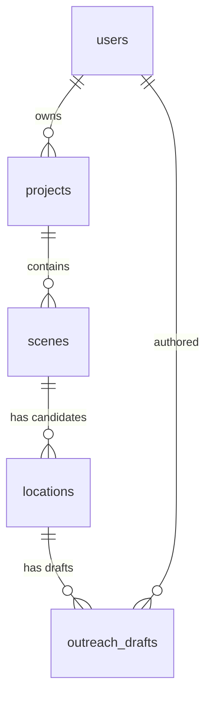

# CineScout architecture

CineScout grows the hackathon prototype (`src/`, `public/`) into a full-stack
production tool: a Spring Boot / WebFlux backend in `backend/`, PostgreSQL for
persistence, and a React frontend (planned).

## Data model

| Table | Purpose | Key columns |
|---|---|---|
| `users` | Accounts (Spring Security principal) | `email` (unique, case-insensitive), `password_hash`, `role` |
| `projects` | A film / production | `owner_id`, `title`, `location_area`, `status` |
| `scenes` | Scene text + LLM-extracted requirements | `source_text`, `setting_type`, `visual_mood`, `lighting_needs`, `time_of_day`, `acoustic_sensitivity`, `estimated_crew_size`, `shoot_date_start/end`, `requirements_json` |
| `locations` | A candidate venue for one scene | `latitude/longitude`, `source_url`, `booking_friction`, `fit_score`, `footprint_warnings`, `logistics_json`, `status` |
| `outreach_drafts` | Emails to venue owners | `location_id`, `created_by`, `subject`, `body`, `tone`, `status` |

## Design decisions

- **Ownership is a single chain**: `users -> projects -> scenes -> locations -> outreach_drafts`.
  Every row is reachable from exactly one owner, so authorization is one join
  to `projects.owner_id`. Deletes cascade down the chain (verified against a
  real Postgres).
- **Typed columns for what we query, JSONB for what we don't.** The six parsed
  requirements are real columns; the raw model output is kept alongside in
  `requirements_json`. Prompt changes therefore never need a migration.
- **The search area lives on the project** (`projects.location_area`, free text such as
  "Brooklyn, New York"): a film usually shoots in one region and every scene inherits it.
  It is nullable, and scouting asks for it rather than guessing a place to search.
- **Scouting is a pipeline plus a persistence service.** `ScoutingPipeline` (no database) extracts a
  scene's requirements, searches the project's area and has the model assess each venue; every
  LLM and search call runs through a `Guard` (retry with back-off inside a circuit breaker).
  `SceneScoutingService` stores the results. Database work runs on `boundedElastic` in short
  transactions that never span a model or search call, and every step re-checks scene ownership.
  Only outages trip a breaker; a model that answers badly is retried but never counted as down.
- **Outreach reuses the same shape.** `OutreachGenerationService` reads a small `OutreachBrief` in one
  transaction, calls the model through the shared `llm` guard (so one breaker covers scouting and
  outreach), and saves the draft in another, re-checking ownership at both ends. The brief is
  deliberately short: the script, the project description, the user's private notes and the fit score
  never reach the model, so they cannot appear in an email to a stranger. Several drafts per location
  are allowed; `sent_at` is stamped when a draft first leaves `DRAFT` and cleared if it goes back.
  The API never sends email.
- **Re-scouting is additive**: a page already saved for the scene is left alone, so a user's
  shortlist and notes survive. A venue the model cannot assess is dropped and counted, never guessed at.
- **The web layer is thin.** Controllers validate and delegate; services own the transactions and
  return DTOs. Every failure leaves as an RFC 9457 problem: domain errors keep their safe messages,
  provider failures map by kind (503 + `Retry-After` or 502, with a `retryable` flag) and never quote
  the underlying message, and anything unexpected is a fixed 500.
- **Authentication is HTTP Basic** against the `users` table (BCrypt, stateless), isolated in
  `SecurityConfig` so tokens can replace it later without touching controllers, which only receive an
  `AuthenticatedUser`. Registration always creates a `USER` and can be closed by configuration.
- **Logistics (module B) run on demand per location and are cached on it** (`logistics_json`,
  `logistics_fetched_at`, the report exactly as returned), so viewing a location never re-hits the
  providers, and scouting ten venues does not fire forty calls at free public services. Moving a location
  (`PUT .../coordinates`) drops its cache.
- **Solar times are computed locally** (NOAA equations), not fetched: sunrise, sunset, golden hour
  (sun -4 to 6 degrees) and blue hour (-6 to -4), plus the windows that match the scene's time of day.
  They are shown in the location's time zone, which the weather provider resolves.
- **Weather is honest about what it is.** A forecast reaches about two weeks; a shoot further out gets
  the weather recorded on the same date in an earlier year, labelled `PAST_YEAR`, never passed off as a
  forecast.
- **Each logistics provider sits behind a neutral interface** (`WeatherClient`, `PlacesClient`,
  `Geocoder`), like the LLM and search clients, with Open-Meteo, Overpass and Nominatim behind them. Weather
  and places are fetched at the same time and each may fail without failing the report: the section is
  marked `UNAVAILABLE` or `PARTIAL`. Places are tried once (a busy Overpass server answers slowly, and
  retrying only adds to its load); weather and geocoding are retried. A venue without coordinates is
  geocoded from its address, or its name in the project's area, and the result is kept.
- **Noise risk is a rule of thumb from the map**, not a measurement: each nearby source (airport, railway,
  major road, construction, school, nightlife...) scores its loudness plus its proximity within a
  kind-specific radius; the location's risk is the loudest source, shifted by the scene's acoustic
  sensitivity. The report carries the attribution the data licences require (OpenStreetMap ODbL,
  Open-Meteo CC BY).
- **Provenance is stored**: `source_url`, `source_provider` and
  `source_excerpt` record where each venue came from. `source_provider` is a
  plain string so the search backend can change without touching the schema.
- **TEXT + CHECK instead of native enums**, so adding a status is an ordinary
  migration.
- **`updated_at` is maintained by a trigger**, not by application code.
