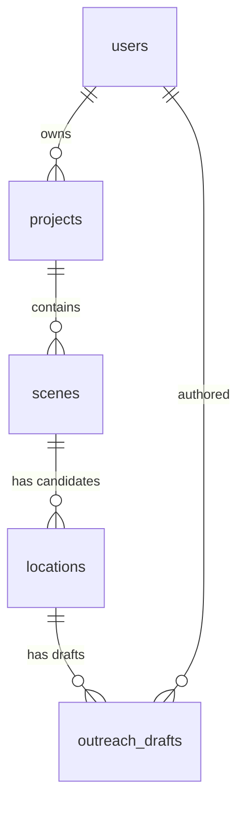

# CineScout architecture

CineScout grows the hackathon prototype (`src/`, `public/`) into a full-stack
production tool: a Spring Boot / WebFlux backend in `backend/`, PostgreSQL for
persistence, and a React frontend (planned).

## Data model

| Table | Purpose | Key columns |
|---|---|---|
| `users` | Accounts (Spring Security principal) | `email` (unique, case-insensitive), `password_hash`, `role` |
| `projects` | A film / production | `owner_id`, `title`, `status` |
| `scenes` | Scene text + Gemini-extracted requirements | `source_text`, `setting_type`, `visual_mood`, `lighting_needs`, `time_of_day`, `acoustic_sensitivity`, `estimated_crew_size`, `shoot_date_start/end`, `requirements_json` |
| `locations` | A candidate venue for one scene | `latitude/longitude`, `source_url`, `booking_friction`, `fit_score`, `footprint_warnings`, `logistics_json`, `status` |
| `outreach_drafts` | Emails to venue owners | `location_id`, `created_by`, `subject`, `body`, `tone`, `status` |

## Design decisions

- **Ownership is a single chain**: `users -> projects -> scenes -> locations -> outreach_drafts`.
  Every row is reachable from exactly one owner, so authorization is one join
  to `projects.owner_id`. Deletes cascade down the chain (verified against a
  real Postgres).
- **Typed columns for what we query, JSONB for what we don't.** The six parsed
  requirements are real columns; the raw model output is kept alongside in
  `requirements_json`. Prompt changes therefore never need a migration.
- **Module B results are cached on the location** (`logistics_json`,
  `logistics_fetched_at`) so viewing a location does not re-hit the solar,
  weather and places APIs.
- **Provenance is stored**: `source_url`, `source_provider` and
  `source_excerpt` record where each venue came from. `source_provider` is a
  plain string so the search backend can change without touching the schema.
- **TEXT + CHECK instead of native enums**, so adding a status is an ordinary
  migration.
- **`updated_at` is maintained by a trigger**, not by application code.
